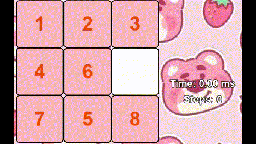
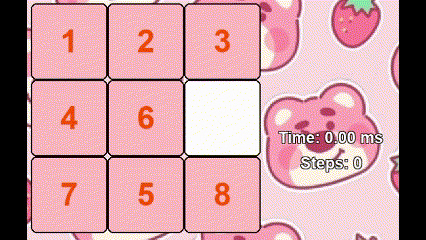
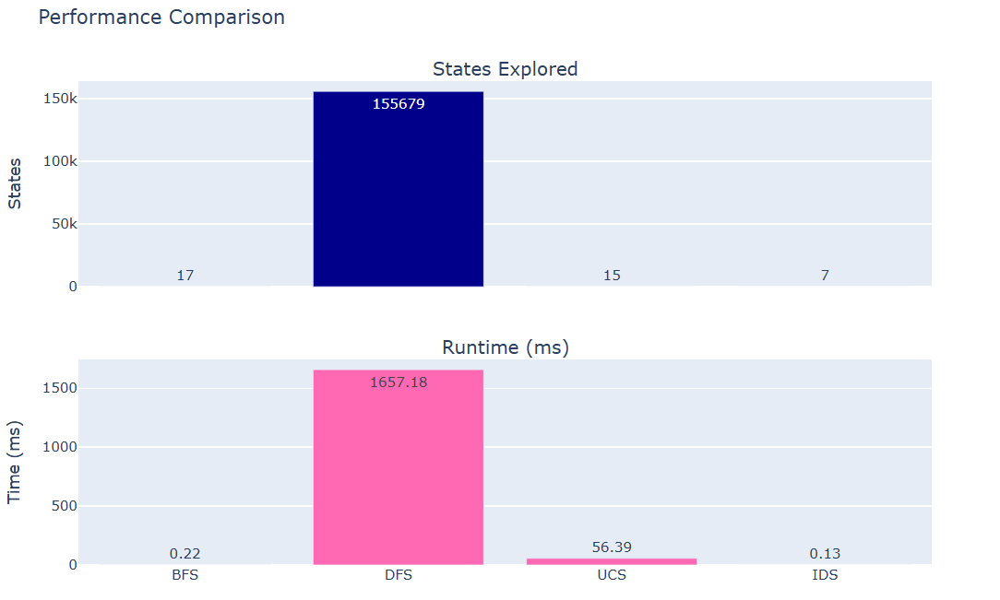

# GIỚI THIỆU BÀI TOÁN 8-PUZZLE
8-Puzzle là một bài toán cổ điển trong trí tuệ nhân tạo, bao gồm một bảng vuông 3x3 với 8 ô đánh số từ 1 đến 8 và một ô trống (0). Mục tiêu của bài toán là sắp xếp lại các ô sao cho chúng nằm đúng vị trí theo trạng thái mục tiêu đã định, bằng cách di chuyển các ô kề với ô trống vào vị trí của nó.
# 1. MỤC TIÊU
Mục tiêu chính của dự án là xây dựng một phần mềm trực quan, linh hoạt để giải quyết bài toán 8-Puzzle – một trong những bài toán kinh điển trong lĩnh vực trí tuệ nhân tạo và tối ưu hóa.

Dự án không chỉ giúp người dùng hiểu rõ cách các thuật toán tìm kiếm hoạt động mà còn so sánh trực tiếp hiệu suất giữa chúng thông qua số bước giải và thời gian thực thi. Giao diện trực quan cho phép hiển thị các bước giải, trạng thái trung gian và các trạng thái belief (niềm tin) trong môi trường không xác định, giúp người học dễ dàng quan sát và phân tích quá trình giải của từng thuật toán.

Ngoài ra, dự án còn hướng đến mục tiêu giảng dạy và nghiên cứu, hỗ trợ sinh viên, giảng viên hoặc lập trình viên có thể thử nghiệm, mở rộng hoặc tích hợp các phương pháp AI nâng cao vào bài toán cổ điển này.
# 2. NỘI DUNG
## 2.1 Nhóm thuật toán tìm kiếm không có thông tin (Uninformed Search Algorithms)
Các thành phần chính của bài toán tìm kiếm và giải pháp
- Trạng thái ban đầu:
    Một lưới 3x3 với 8 số từ 1 đến 8 và một ô trống (0), là trạng thái khởi đầu của bài toán ([[1 2 3], [0 5 6], [4 7 8]]).
- Trạng thái mục tiêu:
    Lưới 3x3 với thứ tự số từ 1 đến 8 và ô trống ở vị trí cuối cùng ([[1 2 3], [4 5 6], [7 8 0]]).
- Không gian trạng thái:
    Tập hợp tất cả các cách sắp xếp cụ thể vị trí các ô của lưới 3x3.
- Hành động:
    Ô trống di chuyển lên, xuống, trái, phải để hoán đổi với ô liền kề dựa trên một thuật toán để tìm trạng thái đích
- Chi phí:
    Mỗi bước di chuyển có chi phí bằng 1
- Giải pháp:
    Từ trạng thái ban đầu, tìm ra trạng thái mục tiêu từ các thuật toán tìm kiếm không có thông tin như BFS, DFS, UCS, IDS

  Hình ảnh gif từng thuật toán cùng biểu đồ so sánh

      BFS

  

      DFS

  

      UCS

  

      IDS

  

So sánh các thuật toán:

Đánh giá các thuật toán:

Breadth-First Search (BFS): Thuật toán duyệt theo từng lớp trạng thái nên có khả năng tìm được lời giải ngắn nhất. Tuy nhiên, vì phải lưu trữ toàn bộ các trạng thái trong hàng đợi ở mỗi mức, BFS rất tốn bộ nhớ nếu không gian trạng thái lớn.

Depth-First Search (DFS): Ưu điểm lớn nhất của DFS là mức sử dụng bộ nhớ thấp, do chỉ cần theo dõi trạng thái trên đường đi hiện tại. Dẫu vậy, do đi sâu trước nên DFS có thể đi lệch hướng và bị mắc kẹt, đặc biệt nếu lời giải nằm gần gốc.
    
Uniform-Cost Search (UCS): Giống như BFS nhưng xét đến chi phí giữa các trạng thái. UCS luôn tìm được đường đi tối ưu nếu chi phí khác nhau. Tuy nhiên, trong 8-Puzzle, chi phí các bước di chuyển giống nhau nên UCS hoạt động gần như BFS.
    
Iterative Deepening Search (IDS): Là sự kết hợp giữa DFS và BFS, IDS mở rộng tìm kiếm theo từng mức sâu, giúp tiết kiệm bộ nhớ như DFS nhưng vẫn đảm bảo tìm được lời giải như BFS. Đây là lựa chọn phù hợp cho các bài toán có độ sâu lời giải không lớn, như 8-Puzzle.

Tổng kết
    
Trong bối cảnh của bài toán 8-Puzzle, IDS là thuật toán nổi bật nhất nhờ sự cân bằng giữa độ hiệu quả và mức tiêu thụ bộ nhớ. DFS lại thường kém hiệu quả hơn, dễ bị lạc hướng nếu không có kiểm soát độ sâu phù hợp.
    
